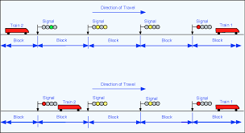
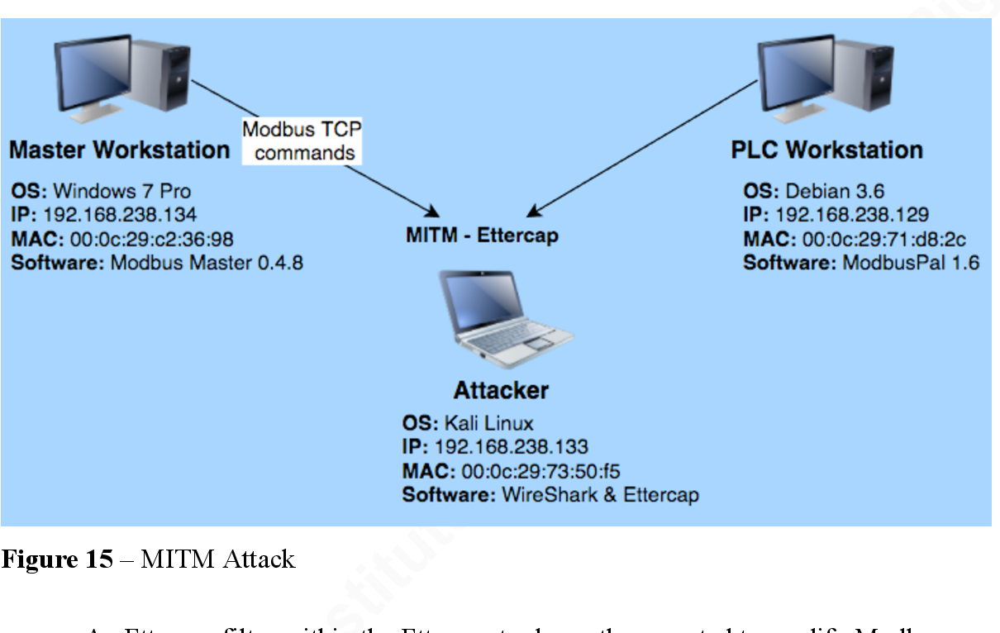
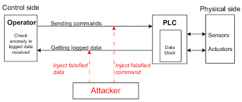
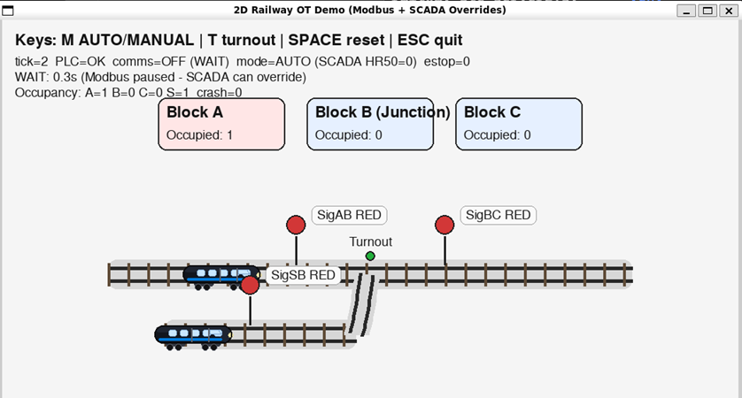
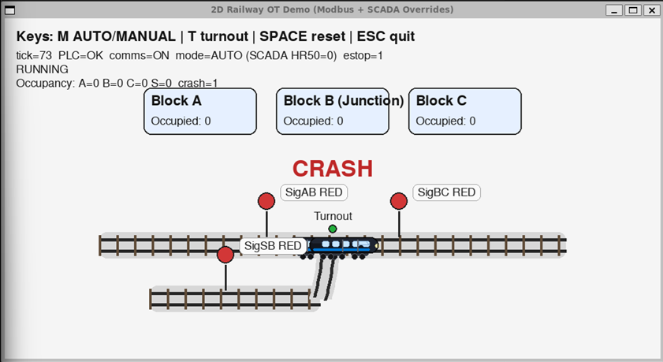

**OT Railway SCADA Security Lab**

**From Interlocking Theory to Modbus MITM Detection in Microsoft
Sentinel**

**1. What is Operational Technology (OT)?**

Operational Technology (OT) refers to **hardware and software systems
that monitor, control, and automate physical processes**. Unlike IT
systems, where failures usually impact data, **OT failures directly
affect the physical world**, often with safety consequences.

**In railways, OT failures can cause:**

-   Unsafe train movements

-   Signal misalignment

-   Track collisions

-   Loss of life and regulatory breaches

**Common OT sectors:**

-   Railways & transportation

-   Power grids

-   Water treatment

-   Oil & gas

-   Manufacturing

**Key OT security reality:**

*Availability and safety are more critical than confidentiality.*

**2. Core OT Components in Railway Systems**

  -----------------------------------------------------------------------
  **Component**               **Role**
  --------------------------- -------------------------------------------
  **PLC (Programmable Logic   Executes deterministic logic controlling
  Controller)**               signals and turnouts

  **Sensors**                 Detect train presence (track circuits, axle
                              counters)

  **Actuators**               Signals, points/turnouts, barriers

  **SCADA / HMI**             Operator monitoring and manual control
                              interface
  -----------------------------------------------------------------------

This lab focuses on **logic-layer attacks**, not malware.

**3. Railway Interlocking -- Safety by Design**

Interlocking is the **core safety mechanism** in railway signalling.\
Its sole purpose is to **prevent unsafe train movements**.

**Fundamental interlocking rules:**

-   Only **one train per block**

-   Signals turn GREEN **only if destination block is clear**

-   Turnouts are **locked during train movement**

-   Conflicting routes are **physically impossible**

If interlocking fails, the railway is no longer safe---*even if all
hardware works.*

**4. Modbus TCP -- Why It's Dangerous in OT**

Modbus TCP is a **legacy industrial protocol** still widely used in
rail, energy, and manufacturing.

**Security limitations:**

-   ❌ No authentication

-   ❌ No encryption

-   ❌ No integrity checking

-   ❌ No replay protection

**Any system that can connect can read or write PLC registers.**

This lab intentionally exploits these weaknesses.

**5. Lab Architecture Overview**

This lab models a realistic Operational Technology (OT) railway control
environment, including control logic (PLC), supervisory control
(SCADA/HMI), field signals, and adversarial interaction over Modbus TCP.

The goal is to show how cyber actions translate into physical
consequences.

**Components:**

-   **PLC Simulator** (railway_plc_server.py)

-   **Physical Process Simulator** (railway_pygame.py)

-   **ScadaBR** (Operator HMI)

-   **MITM Proxy**

-   **Azure VM with Sentinel Agent**

**Network Flow:**

ScadaBR / Railway Game

\|

\| Modbus TCP

v

\[ MITM Proxy (5021) \]

\|

\| Modified / Replayed Frames

v

\[ PLC Simulator (5020) \]

**6. Signal & Register Mapping**

**Holding Registers (PLC Memory)**

  -----------------------------------------------------------------------
  **Register**             **Description**
  ------------------------ ----------------------------------------------
  HR\[0\]                  SigAB (0=RED, 1=GREEN)

  HR\[1\]                  SigBC (0=RED, 1=GREEN)

  HR\[2\]                  SigSB (0=RED, 1=GREEN)

  HR\[50\]                 Mode (AUTO / MANUAL)

  HR\[100--102\]           Block occupancy (A/B/C)

  HR\[103\]                Crash indicator
  -----------------------------------------------------------------------

**7. Normal Operation -- AUTO Mode**

-   System starts with **all signals RED**

-   PLC enforces interlocking logic

-   **Train T1 has priority over T2**

-   Signals automatically return to RED

-   Block occupancy is validated before allowing movement

✔ Safe\
✔ Deterministic\
✔ Predictable

**8. Manual Mode via SCADA (The Dangerous Feature)**

-   Operator switches to **MANUAL**

-   SCADA directly writes PLC registers

-   Interlocking logic is bypassed

-   Unsafe commands are **not validated**

Manual mode exists for maintenance---but becomes an attack vector.

**9. Attack Scenario -- Unsafe Control Command**

**Attack Steps:**

1.  Switch system to **MANUAL**

2.  Force **SigBC = GREEN**

3.  Block B is already occupied

4.  Two trains enter the same block

5.  **Collision occurs**

6.  HR\[103\] crash bit is set

🚨 **This is a pure logic-layer OT attack**\
No exploit. No malware. No credentials.

**10. Why This Attack Works**

-   PLC **trusts SCADA blindly**

-   No validation between signal and occupancy

-   Modbus provides **no security controls**

-   Manual mode disables safety logic

*The system behaves exactly as designed but insecurely.*

**11. Detection Opportunities (Blue Team View)**

**Observable Indicators:**

-   Signal GREEN while destination block is occupied

-   Rapid repeated Modbus writes

-   Manual mode enabled during unsafe states

-   Crash register toggled

**This is where SOC visibility matters.**

**12. Learning Outcomes (OT Fundamentals)**

This lab teaches:

-   OT vs IT security differences

-   Interlocking as a safety control

-   Why manual overrides are dangerous

-   Why network security alone is insufficient

**OT Security Lab -- Detecting Modbus MITM & Replay Attacks with
Microsoft Sentinel**

This lab simulates a **real railway control system** and shows how
**cyber attacks against OT networks** can cause **real physical
accidents**, and how a **SOC can detect them using Microsoft Sentinel**.

**13. Lab Objective**

This lab demonstrates **realistic ICS attack detection** using Microsoft
Sentinel, including:

-   Modbus MITM manipulation

-   Signal spoofing

-   Replay-style control injection

-   Safety-impact escalation (collisions)

Ideal for:

-   SOC training

-   CTFs

-   Conference demos

-   OT security interviews

**14. Attack Scenarios**

**Attack 1 -- Signal Spoofing (MITM Proxy)**

-   Modifies FC16 writes

-   Forces SigBC → GREEN

-   Causes unsafe movement

**Attack 2 -- Replay-Style Injection**

-   Replays valid FC6 writes

-   No nonce, no freshness checks

-   Timing-based abuse

**Attack 3 -- Safety Impact**

-   PLC accepts unsafe state

-   Physical simulation collides

-   Crash bit propagates

**15. Data Collection for Sentinel**

**Packet Capture:**

sudo tcpdump -i any port 5020 or port 5021 -w modbus_attack.pcap

**Log Conversion:**

tcpdump -nn -tt -r modbus_attack.pcap \> modbus_events.log

**16. Sentinel Detection Logic (KQL)**

**Forced Signal Changes**

CustomModbusLogs

\| where Register == 1 and Value == 1

\| summarize count() by SourceIP, bin(TimeGenerated, 1m)

\| where count\_ \> 5

**MITM Behaviour**

CustomModbusLogs

\| where DestinationPort == 5020

\| summarize dcount(SourceIP) by bin(TimeGenerated, 1m)

\| where dcount_SourceIP \> 1

**Replay-Like Timing**

CustomModbusLogs

\| where FunctionCode == 6

\| summarize count() by SourceIP, Register, bin(TimeGenerated, 1s)

\| where count\_ \> 3

**Safety Impact**

CustomModbusLogs

\| where Register == 103 and Value == 1

🚨 **Critical alert -- physical process impact**

**17. MITRE ATT&CK for ICS -- Railway Mapping**

**Why ATT&CK for ICS Matters in Rail**

-   Safety-centric threat model

-   OT-specific adversary behaviour

-   Vendor-agnostic benchmarking

-   Detection engineering alignment

-   Regulatory reporting support

**Mapping Table**

  ------------------------------------------------------------------------
  **Technique**                          **ID**   **Applied in Lab**
  -------------------------------------- -------- ------------------------
  Unauthorized Command Message           T0855    Forced SigBC GREEN

  Modify Control Logic                   T0831    Manual mode bypass

  Man-in-the-Middle                      T0830    Modbus proxy

  Loss of Safety                         T0880    Train collision

  Impair Process Control                 T0827    Disrupted operations
  ------------------------------------------------------------------------

**18. Why This Lab Is Strong**

✔ Real OT protocol\
✔ Real attack techniques\
✔ Real SOC tooling\
✔ Clear safety impact\
✔ Highly interview-ready

**19. Optional Extensions (Advanced)**

-   Defender for IoT integration

-   Zeek Modbus parser

-   PLC command allow-listing

-   Insider threat simulation

-   Safety-logic enforcement alerts

**OT Risk Assessment -- Railway SCADA & PLC Environment**

**1. Scope of the Risk Assessment**

This risk assessment evaluates the **cybersecurity and safety risks**
associated with the simulated **railway signalling and interlocking
system** implemented in the OT Security Lab.

**Systems in Scope**

-   PLC Simulator (Modbus TCP)

-   SCADA/HMI (ScadaBR)

-   Railway physical process simulator

-   Modbus TCP network

-   Manual override functionality

-   SOC visibility via Microsoft Sentinel

**Assets at Risk**

-   Train movement safety

-   Signalling integrity

-   Interlocking logic

-   Operational availability

-   Regulatory compliance

-   Human safety (modeled)

**2. Threat Model Overview**

**Threat Actors**

-   Malicious insider (operator abuse)

-   Network-based attacker (MITM)

-   Red team / CTF participant

-   Misconfigured SCADA user

**Attack Surface**

-   Modbus TCP (port 502 / 5020 / 5021)

-   Manual mode register

-   Signal control registers

-   Lack of authentication and encryption

-   Flat OT network trust model

**3. Key Risks Identified**

**Risk 1 -- Unsafe Signal Manipulation (Signal Spoofing)**

**Description**\
An attacker or operator forces a signal to GREEN while the destination
block is occupied.

**Cause**

-   Modbus allows unauthenticated writes

-   Manual mode disables interlocking

-   No validation between signal and occupancy

**Impact**

-   Two trains enter the same block

-   Collision occurs

-   Loss of safety (HR\[103\] crash bit set)

**Risk Rating**

-   Likelihood: **High**

-   Impact: **Critical**

-   Overall Risk: **Extreme**

**MITRE ATT&CK for ICS**

-   T0855 -- Unauthorized Command Message

-   T0880 -- Loss of Safety

**Risk 2 -- Man-in-the-Middle (MITM) Attack on Modbus**

**Description**\
Attacker intercepts Modbus traffic and modifies control commands in
transit.

**Cause**

-   No encryption or integrity in Modbus

-   No device authentication

-   Trusted network assumption

**Impact**

-   Signals altered without operator knowledge

-   Interlocking logic bypassed indirectly

-   Unsafe train movements

**Risk Rating**

-   Likelihood: **Medium--High**

-   Impact: **Critical**

-   Overall Risk: **High**

**MITRE ATT&CK for ICS**

-   T0830 -- Man-in-the-Middle

-   T0827 -- Impair Process Control

**Risk 3 -- Replay Attack on Control Commands**

**Description**\
Previously valid Modbus commands are replayed at unsafe times.

**Cause**

-   No timestamps or sequence numbers

-   PLC accepts stale commands

-   Stateless protocol design

**Impact**

-   Signals re-enabled when they should be red

-   Trains move into unsafe routes

-   Collision potential

**Risk Rating**

-   Likelihood: **Medium**

-   Impact: **High**

-   Overall Risk: **High**

**MITRE ATT&CK for ICS**

-   T0855 -- Unauthorized Command Message

**Risk 4 -- Abuse of Manual Mode**

**Description**\
Manual mode disables interlocking logic and allows unrestricted writes.

**Cause**

-   Manual mode has no secondary authorization

-   No monitoring of unsafe manual actions

-   SCADA fully trusted

**Impact**

-   Safety logic bypassed by design

-   Operator error or malicious intent causes accidents

**Risk Rating**

-   Likelihood: **High**

-   Impact: **Critical**

-   Overall Risk: **Extreme**

**MITRE ATT&CK for ICS**

-   T0831 -- Modify Control Logic

-   T0880 -- Loss of Safety

**Risk 5 -- Lack of Detection and Alerting**

**Description**\
Unsafe control actions occur without immediate alerting.

**Cause**

-   No native PLC security logging

-   OT traditionally not monitored by SOC

-   Signals and occupancy not correlated

**Impact**

-   Attacks remain undetected

-   Safety incidents escalate

-   Delayed response

**Risk Rating**

-   Likelihood: **High**

-   Impact: **High**

-   Overall Risk: **High**

**4. Risk Summary Table**

  ---------------------------------------------------------------------------
  **Risk**                     **Likelihood**      **Impact**   **Overall**
  ---------------------------- ------------------- ------------ -------------
  Signal Spoofing              High                Critical     **Extreme**

  MITM Attack                  Medium--High        Critical     **High**

  Replay Attack                Medium              High         **High**

  Manual Mode Abuse            High                Critical     **Extreme**

  Lack of Detection            High                High         **High**
  ---------------------------------------------------------------------------

**5. Existing Controls (In the Lab)**

**Technical Controls**

-   PLC crash indicator (HR\[103\])

-   Signal and occupancy tracking

-   Sentinel-based detection rules

-   Network capture (Wireshark / tcpdump)

**Procedural Controls**

-   Manual vs Auto mode separation

-   Demonstrated operator awareness

**6. Recommended Mitigations**

**Short-Term (Detective)**

-   Sentinel alerts for:

    -   Signal GREEN + occupancy = 1

    -   Repeated Modbus writes

    -   Manual mode activation

-   SOC monitoring of OT traffic

**Medium-Term (Preventive)**

-   Disable manual mode in production

-   Implement command allow-listing

-   Network segmentation (SCADA ↔ PLC)

**Long-Term (Strategic)**

-   Secure OT protocols (TLS, authentication)

-   PLC-side interlocking enforcement

-   Defender for IoT integration

-   OT-specific SOC playbooks

**7. Residual Risk**

Even with network monitoring:

-   **Modbus remains insecure**

-   Manual overrides always carry safety risk

-   Human error cannot be fully eliminated

This reinforces the principle:

**OT safety must be enforced at the control logic level, not the network
alone.**

**8. Risk Assessment Conclusion**

This lab demonstrates that:

-   Cyber attacks in OT environments can directly cause **physical
    safety incidents**

-   Legacy protocols like Modbus introduce **systemic risk**

-   Manual overrides are a **high-risk operational necessity**

-   SOC detection using Sentinel is **critical but reactive**

-   True safety requires **defense-in-depth across OT and IT**
